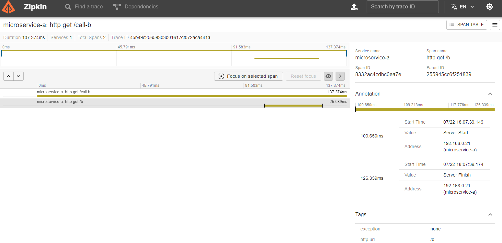

# SpringBoot 3  🍃

## Micrometer with OTEL and Zipking

# Instalation

```shell
  mvn clean install
```

## Support trace propagation with
- Kafka topics
- Threads with @Async

---

# POC

## Running two instances of the application

```shell
  java -jar target/springboot3-0.0.1-SNAPSHOT.jar --server.port=8080
  java -jar target/springboot3-0.0.1-SNAPSHOT.jar --server.port=8081
  docker compose up /src/main/resources/docker-compose.yml
```

## Making curl request to propagate a trace
    
    ```shell
    curl -X GET http://localhost:8080/call-b
    ```

## Span exported to Zipkin 💪



